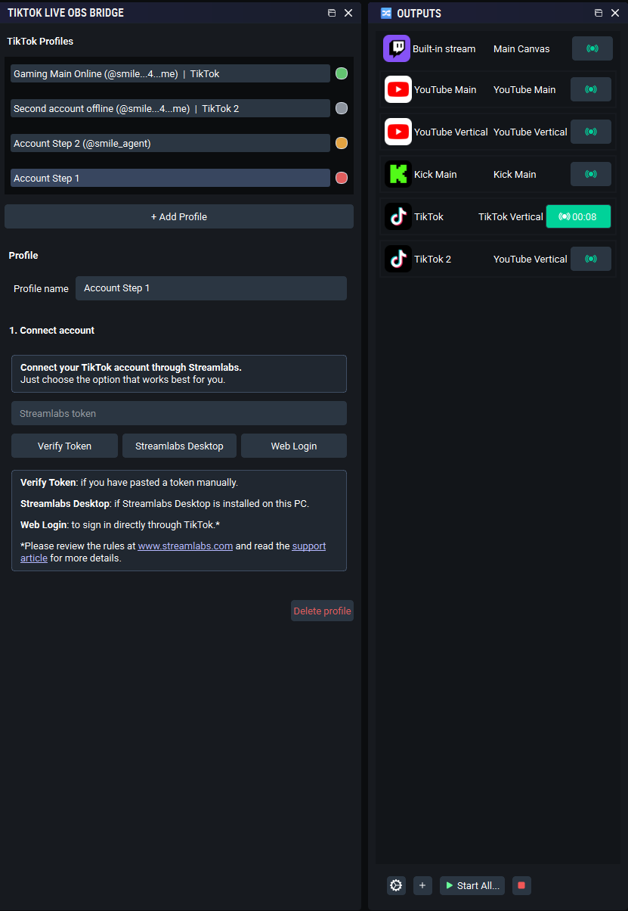
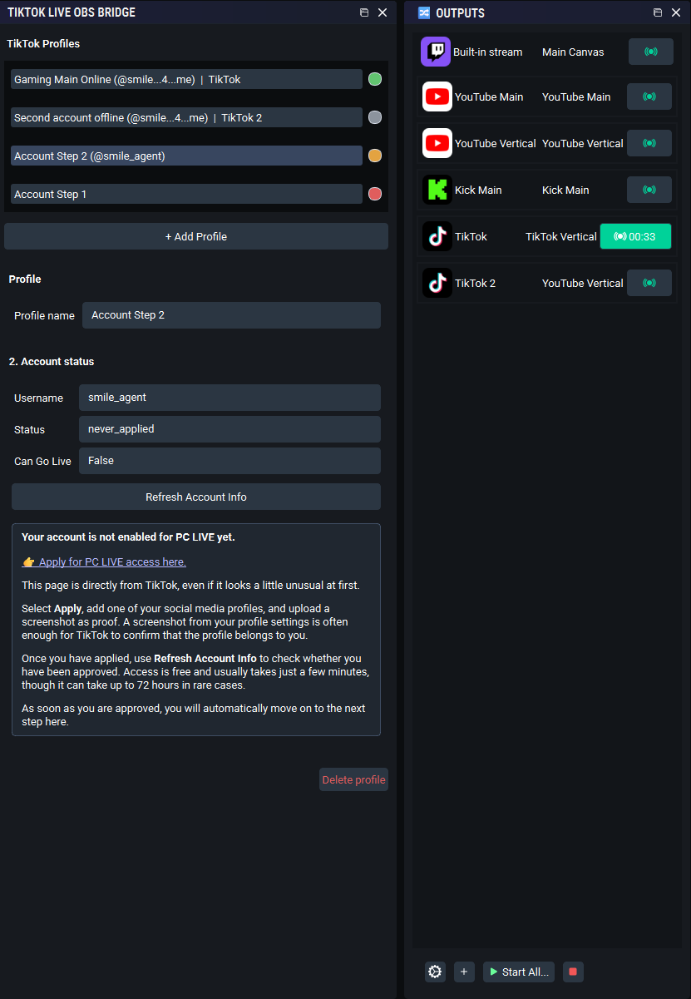
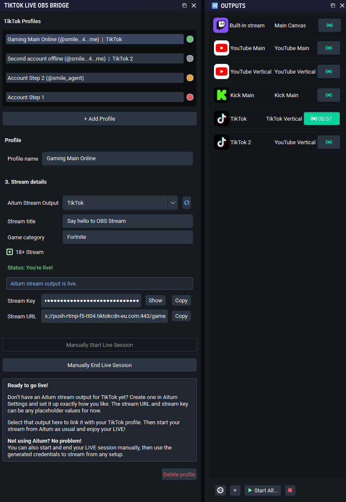
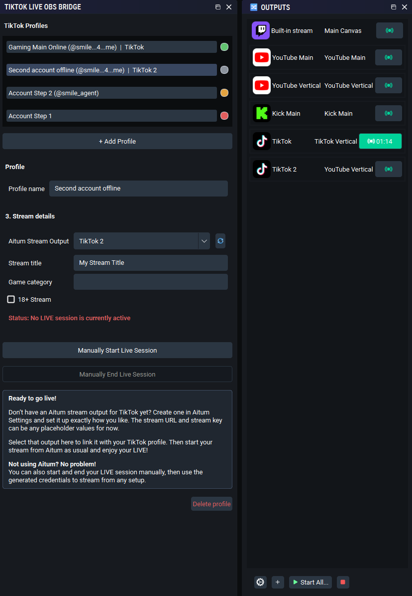

# TikTok Live OBS

> A native OBS Studio plugin for preparing TikTok LIVE sessions, configuring Aitum outputs, and optionally inserting RapidAPI-supplied frame signatures inside OBS.

TikTok Live OBS is a provider-based OBS and Aitum workflow. Each profile can connect directly with the experimental **TikTok LIVE Studio** QR provider, use Streamlabs, or use credentials supplied manually by an authorized source.

It is a community project, not a company product. Please read the information below before using it.

## How it works

<table width="100%">
  <tr>
    <td width="50%" valign="top" align="center">
      <strong>1. Connect your TikTok account</strong>  
      
    </td>
    <td width="50%" valign="top" align="center">
      <strong>2. Get your TikTok LIVE access</strong>  
      
    </td>
  </tr>
  <tr>
    <td width="50%" valign="top" align="center">
      <strong>3. Go live!</strong>  
      
    </td>
    <td width="50%" valign="top" align="center">
      <strong>4. Stream with as many TikTok accounts as you like</strong>  
      
    </td>
  </tr>
</table>

## What it does

✓ Keeps multiple local TikTok profile configurations in one OBS installation.

✓ Lets every profile choose a credentials provider. **TikTok LIVE Studio** performs native device registration, QR login, cookie reuse, LIVE creation, heartbeat, and cleanup inside the plugin; Streamlabs retains its existing workflow; **Manual** accepts a TikTok username, stream URL, and stream key supplied through an authorized source.

✓ Stores each LIVE Studio account independently, keeps its device/install IDs stable, persists cookies refreshed by TikTok responses, and provides an in-dock action that deletes the complete saved login.

✓ Shows whether an account appears ready for PC LIVE access.

✓ Creates and ends TikTok LIVE sessions, including stream title, game category, and 18+ request.

✓ Can update a selected Aitum Stream Suite output with the generated stream URL and key.

✓ Can prefetch signed values from the RapidAPI signer and inject the required H.264/HEVC SEI metadata directly into OBS encoded packets—without an FFmpeg server, local RTMP listener, demux/remux pass, or local signing algorithm.

✓ Can also be used without Aitum: every provider can generate and display a stream URL and key for manual use with a compatible streaming setup.

✓ Prevents two profiles from reserving the same Aitum output or TikTok account at the same time.

✓ Checks whether Aitum actually started an output and cleans up a newly created session when it did not.

✓ Detects a continuable TikTok room after OBS restarts and offers explicit **Resume TikTok LIVE** and **End TikTok LIVE** actions; it never starts broadcasting merely because OBS launched.

✓ Uses OBS' selected language and includes 17 localized dock interfaces: Arabic, Brazilian Portuguese, Chinese (Simplified and Traditional), English, French, German, Hindi, Indonesian, Italian, Japanese, Korean, Russian, Spanish, Thai, Turkish, and Vietnamese.

## Important boundaries

- **Windows is the supported and tested v0.1.2 target.** The source contains best-effort macOS/Linux paths, but those builds and LIVE workflows are not release-validated; see [PLATFORM_SUPPORT.md](PLATFORM_SUPPORT.md).
- **OBS Studio 31.0 or newer is required for in-process frame signing.** The feature uses OBS' encoded-packet callback API.
- **Aitum is optional.** Without it, the dock can generate and display stream credentials for manual use; it never creates a hidden native OBS output.
- **The TikTok LIVE Studio provider requires a RapidAPI subscription/key before QR login.** It uses the hosted signer for request signatures and automatically configures hosted frame signing. Other providers can enable frame signing manually. The plugin never computes request or frame signatures locally and never uploads video frames to the signer.
- **Nothing here is affiliated with, endorsed by, or supported by TikTok, Streamlabs, Aitum, or OBS Studio.**
- The LIVE Studio and Streamlabs/TikTok flows used by this plugin are not public TikTok API contracts. The LIVE Studio provider is experimental and unofficial; TikTok or another service may change, restrict, or remove these flows at any time.
- You are responsible for your account, stream content, and compliance with the terms and rules of every service you use. This project does not promise account eligibility, uninterrupted streaming, or any particular platform outcome.

## Development status

This private repository is under active development. A dedicated installer and public release will follow once the provider architecture is complete.

Changes and migration details for the current patch release are in
[docs/RELEASE_0.1.2.md](docs/RELEASE_0.1.2.md).

The original architecture research is documented in
[docs/research/loukious-tiktok-stream-key-generator-analysis.md](docs/research/loukious-tiktok-stream-key-generator-analysis.md).
It records the external architecture, the RapidAPI boundary, and the later
decision to consume request and frame signatures only from the hosted service
while keeping device registration and packet transformation native to OBS.
Request/frame signing algorithms and local signer fallbacks remain deliberately
absent from this repository.

Any future external provider must pass the
[Future Provider Contract](docs/FUTURE_PROVIDER_CONTRACT.md) before it is
implemented.

The distinction between RapidAPI, an official direct integration, and a
project-owned authorized backend is documented in
[Authorized Backend Options](docs/research/AUTHORIZED_BACKEND_OPTIONS.md).

For an official platform or partner discussion, use the
[Platform Integration Brief](docs/authorization/PLATFORM_INTEGRATION_BRIEF.md).

## Quick start

1. Open **Docks → TikTok Live OBS**, then create or select a profile.
2. On the first page, choose **TikTok LIVE Studio**, **Streamlabs**, or **Manual**.
3. For TikTok LIVE Studio, paste the RapidAPI key, click **Log in with TikTok QR code**, scan with the TikTok mobile app, and confirm on the phone. The plugin securely reuses the resulting account cookies and device IDs on later OBS launches. Streamlabs and Manual retain their existing flows.
4. Choose an Aitum output, or select **Generate and show key and URL only** to use the generated credentials manually.
5. TikTok LIVE Studio configures in-process signing from the saved account automatically. With other providers, enable **Sign video frames inside OBS** and enter the required RapidAPI/signing identifiers manually.
6. Add a title and choose a LIVE Studio topic. A game is requested only when the topic is **Gaming**. TikTok LIVE Studio or Streamlabs creates the LIVE session; Manual applies supplied credentials.
7. The plugin prefetches a five-minute signature window before allowing the selected output to start, then refreshes it in the background.
8. **Create TikTok LIVE** prepares the selected Aitum output or generates credentials for manual use. Start the chosen output yourself, then end the LIVE session in the dock when the stream is over.

## Data and privacy

Profile names and non-secret preferences are saved per OBS installation under the current user's local OBS configuration directory. Streamlabs tokens, generated stream credentials, RapidAPI/frame-signing credentials, LIVE Studio cookies, and device identifiers are stored in the operating system's secret store—**Windows Credential Manager** in the supported build, with best-effort macOS Keychain and Linux Secret Service backends—not in the plugin's INI files.

See [docs/PRIVACY.md](docs/PRIVACY.md) for the exact storage model, its limits, and how uninstalling handles configuration.

## Building from source

The source is included so the plugin can be inspected, improved, and built independently. The supported build requires Windows, CMake, Visual Studio Build Tools, compatible Qt 6 headers/import libraries, and an OBS source tree matching the target ABI. Best-effort macOS/Linux CMake paths are documented separately and do not imply release support.

Detailed, reproducible instructions are in [docs/BUILDING.md](docs/BUILDING.md).

## Credits and respect

This project exists because other projects made the problem understandable:

- [Loukious/StreamLabsTikTokStreamKeyGenerator](https://github.com/Loukious/StreamLabsTikTokStreamKeyGenerator) — the GPL-3.0 reference project whose observed flow and ideas informed this implementation. Thank you, Loukious.
- [Loukious/TikTokStreamKeyGenerator](https://github.com/Loukious/TikTokStreamKeyGenerator) — the public behavioral reference for LIVE Studio device registration, QR/session flow, the hosted signing contracts, and SEI cadence. No request- or frame-signing algorithm is included.
- [OBS Studio](https://obsproject.com/) — the broadcasting platform this plugin extends.
- [Aitum Stream Suite](https://aitum.tv/) — optional output management integration. This project does not bundle, modify, or represent Aitum.

See [THIRD_PARTY_NOTICES.md](THIRD_PARTY_NOTICES.md) for licensing and attribution details.

## Contributing and support

Bug reports and improvements are welcome. Please start with [CONTRIBUTING.md](CONTRIBUTING.md), and do not include tokens, stream keys, account identifiers, or crash dumps containing personal data in public issues.

Security-sensitive reports belong in [SECURITY.md](SECURITY.md), not in a public issue.

### Support the project

If TikTok Live OBS helps your stream and you would like to support its maintenance, you can leave a small tip on Ko-fi. It is completely optional, but always appreciated.

  

## License

Copyright © 2026 TikTok Live OBS Contributors.

This project is licensed under the [GNU General Public License v3.0 only](LICENSE). It is provided **without warranty**; see the license for the full terms.
