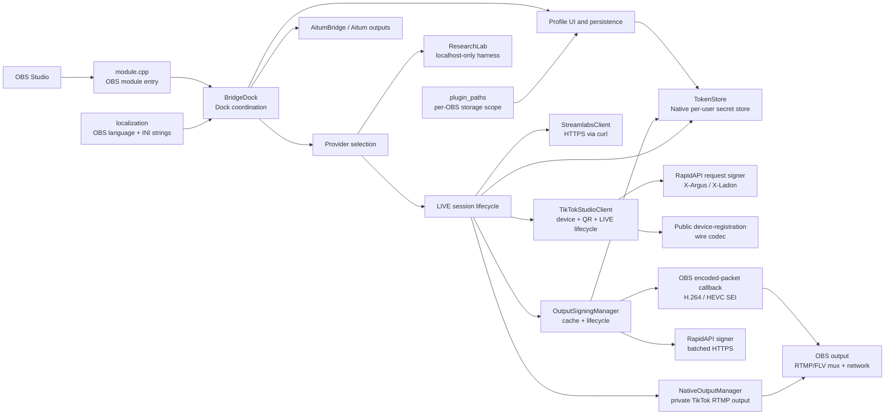

# Architecture

The plugin is intentionally split by responsibility. UI code does not own HTTP implementation, token persistence, or Windows installation scoping.

## Source layout

| Area | Files | Responsibility |
| --- | --- | --- |
| Module entry | `module.cpp` | Registers and removes the OBS dock. |
| Dock coordination | `bridge_dock.cpp`, `bridge_dock.hpp` | Aitum event interception, one-click start handling, output/account selection rules. |
| Profile UI | `bridge_dock_profiles.cpp`, `profile.hpp`, `profile_row.*` | Profile list, login/access state, persisted non-secret metadata. |
| Stream UI and lifecycle | `bridge_dock_streams.cpp` | Metadata input, provider lifecycle, Aitum update, output verification, recovery. |
| Provider selection | `provider_registry.*` | Stable provider identifiers and common capability decisions. |
| Local research harness | `research_lab.*` | A private localhost-only heartbeat test; no TikTok connection or media handling. |
| Streamlabs transport | `streamlabs_client.*`, `streamlabs_desktop.*` | HTTPS requests and opt-in local Streamlabs Desktop token discovery. |
| LIVE Studio transport | `tiktok_studio_client.*`, `tiktok_request_signer.*`, `tiktok_studio_device.*` | Native device registration, account-scoped QR login/cookie reuse, eligibility, LIVE creation, heartbeat/end, and hosted request signatures. |
| LIVE Studio login UI | `tiktok_studio_login_dialog.*`, `tiktok_studio_qr.*`, `tiktok_studio_account.hpp` | Local client-secret-bound QR rendering/polling and the per-account credential model used by the native secret-store backend. |
| Secure storage | `token_store.*`, `secure_storage_*.cpp`, `credential_chunks.hpp` | Windows Credential Manager (tested), plus best-effort macOS Keychain and Linux Secret Service backends; cookie entries remain below the strict Windows blob limit. |
| Hosted signature client | `frame_signing.*` | Validates the RapidAPI endpoint, requests five-minute signature batches, and normalizes returned signed values. It contains no signing algorithm. |
| Encoded metadata | `sei_metadata.*` | Owns the per-output signature cache, Studio-compatible cadence, JSON payload construction, and H.264/HEVC SEI NAL construction. |
| Native TikTok output | `native_output_manager.*` | Creates a private `rtmp_output` with TikTok's server/key and shares OBS' configured stream encoders without replacing the user's main streaming service. |
| OBS output hook | `output_signing_manager.*` | Prefetches and refreshes signatures off the UI/encoder threads, attaches the OBS packet callback to the private TikTok output, a named Aitum output, or OBS' main stream, and replaces only packets that have a due metadata slot. |
| Aitum integration | `aitum_bridge.*`, `aitum_outputs.*` | Aitum vendor requests and settings-dialog update path. |
| Platform boundaries | `plugin_paths.*`, `token_store.*`, `localization.*` | Windows installation scoping, Credential Manager, OBS locale selection. |

## Invariants

1. A TikTok account cannot be active or preparing in more than one local profile at once.
2. An Aitum output cannot be reserved by more than one profile at once.
3. A newly created LIVE session is kept reserved until its provider confirms it ended, including error paths.
4. Aitum's accepted start request is not treated as proof of an active output; the output status is verified.
5. Tokens and generated credentials never enter the profile INI file or log output.
6. Each OBS installation has its own configuration scope; updates at the same path retain that scope.
7. The `research-local` provider never represents a local test as a confirmed TikTok LIVE session.
8. The dock does not start a signing-enabled output until a usable RapidAPI batch is cached; an expired cache or unsupported codec raises an OBS output error and schedules an immediate stop rather than falling back to local signing.
9. RapidAPI credentials and TikTok signing identifiers stay in the operating system's per-user secret store and never enter profile INI files or logs.
10. The plugin never computes TikTok request or frame signatures locally and has no signer fallback. The public device-registration envelope is not a request/frame signature and is implemented locally.
11. LIVE Studio cookies, device/install IDs, and RapidAPI credentials are account-scoped; the profile INI contains only an opaque `account_id` reference.
12. Once an account has a valid device/install pair, ordinary session updates cannot rotate it; deleting the saved login is the explicit identity-reset boundary.
13. Restart recovery may inspect and reserve a continuable room, but it never starts an OBS output automatically. Resuming requires an explicit user action that recreates signing and output callbacks.

## In-process media path

OBS 31 introduced a synchronous encoded-packet callback that runs after encoding and interleaving but before the selected output's muxer. For LIVE Studio's built-in path, the plugin creates a separate native OBS RTMP output, shares the configured stream encoders, attaches signing to that output, and starts it automatically. Aitum and Manual paths can instead attach to a selected Aitum output or OBS' main stream. The main-output binding is rechecked on OBS' `STREAMING_STARTING` event so multitrack/output setup cannot swap the target after prefetch. For H.264 or HEVC video track 0:

1. packets without a due metadata slot pass through without allocation or copying;
2. when a slot is due, the session chooses a prefetched signature for the current wall-clock second;
3. one or more payload-type-100 SEI NAL units are built in Annex-B form and prepended to the encoded access unit;
4. OBS' ref-counted packet helper creates the replacement packet; and
5. the existing output continues through its normal FLV/RTMP mux and network path.

There is no listening socket, FFmpeg child process, media decode, re-encode, demux, or intermediate remux. HTTPS work never runs on the encoder callback. Timestamp resets or long encoder gaps restart the cadence instead of attempting unbounded catch-up. Signature batches cover five minutes and refresh in the background before their final minute; worker cancellation and join-on-unload keep asynchronous code from outliving the plugin DLL.

## Change guidance

Before changing the flow, identify which invariant it affects. A feature that weakens an invariant needs an explicit safety argument and test coverage, not just a working UI path.
