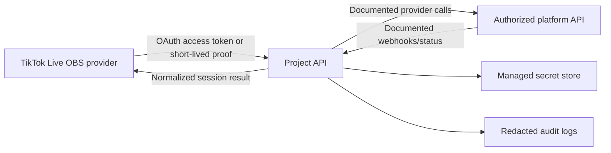

# Authorized Backend Options

## Decision summary

RapidAPI is a commercial API marketplace and gateway. It is not an intrinsic
requirement for an OBS plugin, a local relay, or a desktop UI. A provider can
technically call a directly hosted, officially authorized API instead.

That does **not** mean an undocumented service can safely be replaced with a
self-hosted implementation. An own backend is appropriate only after an
official contract or documented integration provides the necessary endpoint,
authentication, lifecycle, and data-handling rules.

## Options

| Option | What it is | Suitable when | Main trade-off |
| --- | --- | --- | --- |
| Official direct integration | OBS plugin contacts a documented provider API directly. | The provider supports desktop/client OAuth and a public API. | Lowest operations burden; depends on provider uptime and client-auth model. |
| Authorized backend | A project-controlled service holds server credentials and exposes a narrow API to the plugin. | The provider requires confidential server credentials or reliable server-side webhooks. | Adds operations, security, privacy, monitoring, and incident-response duties. |
| Authorized agency/platform provider | The plugin uses credentials or endpoints supplied by a provider authorized for the account. | The provider documents a supported workflow for user-managed credentials. | Capabilities and terms vary by agency/platform. |
| RapidAPI gateway | A third-party marketplace/gateway fronts an API offered by its publisher. | Its publisher is authorized and the service contract covers the required workflow. | Adds a third party, key management, usage limits, and dependency risk. |
| Local Research Lab | No external platform calls; generic localhost lifecycle testing only. | Development before an authorized integration exists. | It cannot create, verify, or operate a platform LIVE session. |

## What RapidAPI changes — and what it does not

RapidAPI commonly provides:

- a marketplace listing and subscription plan;
- a gateway hostname;
- an API key and gateway headers;
- rate limiting and usage accounting; and
- a publisher-defined API contract.

It does not by itself grant permission to emulate a platform client, reproduce
undocumented request formats, or operate a platform session. The authorization
question belongs to the API publisher and the underlying platform agreement,
not merely to the presence of a RapidAPI endpoint.

## Own-backend minimum architecture

If an authorized integration later requires a backend, use a deliberately
narrow design:

Required controls:

1. User credentials are short-lived where possible; no raw stream key is
   written to application logs.
2. Server credentials live in a managed secret store, never in the plugin.
3. Every provider call has explicit timeouts, retry policy, idempotency rules,
   and a correlation identifier.
4. The service exposes a session status/recovery endpoint so OBS can resolve a
   reservation after restart.
5. The project publishes a privacy notice naming the backend, data categories,
   retention period, and deletion path.
6. The deployment has backups, monitoring, key rotation, incident response,
   and an owner responsible for outages.

## Provider contract additions for a backend

Before implementing a backend-backed provider, add the following to its design
review:

- official base URLs and authentication grants;
- approved OAuth redirect URIs and scopes;
- account and stream-session retention policy;
- regional data residency requirements;
- webhook verification method supplied by the platform;
- error taxonomy and rate limits;
- deprecation/compatibility commitment; and
- written approval for any metadata, encoder, or ingest-related capability.

## Explicit non-solution

Operating a project-controlled service to reproduce private signing,
integrity, encoder, or media behavior would not turn that behavior into an
authorized API. This project will not use an own backend for that purpose.

## Sources consulted during research

- [RapidAPI API security](https://docs.rapidapi.com/v2.0.0/docs/configuring-api-security)
- [RapidAPI additional request headers](https://docs.rapidapi.com/v2.0/docs/additional-request-headers)
- [Future Provider Contract](../FUTURE_PROVIDER_CONTRACT.md)
